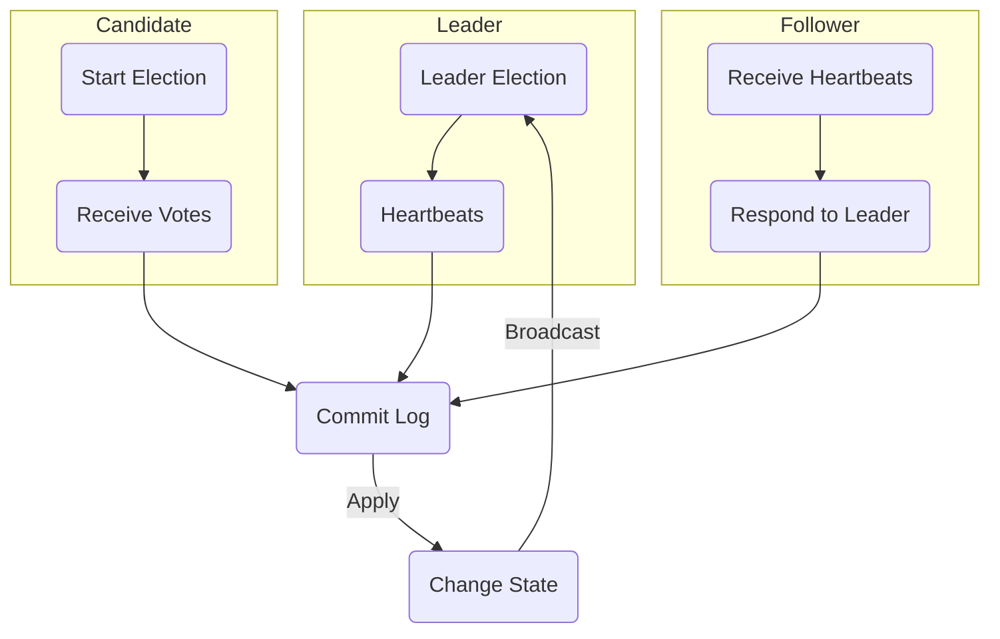

## PyRaft

## Overview

raft algorithm implemented using python and FASTAPI aiming to create a detailed imitation of the mechanisms underlying Zookeeper and Kraft. This project is designed for those intrigued by the inner workings of distributed systems and consensus algorithms. It's an attempt to demystify and replicate the functionalities of these systems, not as a direct replacement, but as a learning tool and a tribute to their complex architectures.

## Objectives

The primary goals of PyRaft include:

- Gaining a deep understanding of the Raft Consensus algorithm, focusing on Leader Election, Log Replication, and Fault Tolerance.
- Exploring the ZAB (Zookeeper Atomic Broadcast) Consensus algorithm.
- Delving into the architectural nuances of Kraft and Zookeeper.
- Implementing an Event-Driven Architecture.
- Studying and replicating key aspects of Kafka's architecture.



This project implements a distributed node management system using Python and FastAPI. It focuses on maintaining a network of nodes, where each node can either be a leader or a follower. The system handles tasks like heartbeat management, metadata handling, and dynamic leader election.

## Features

- **Node Initialization**: Dynamically initialize nodes as leaders or followers based on configuration.
- **Heartbeat Mechanism**: Leaders regularly send heartbeats to followers to maintain the network's health.
- **Event Logging**: Each node maintains an event log, tracking significant actions and heartbeats.
- **Metadata Management**: Nodes store and update metadata information, crucial for network operation.
- **Dynamic Leader Election**: In case of leader failure, followers can elect a new leader.
- **Broker and Topic Management**: API endpoints to manage brokers, topics, and partitions within the network.

## Installation

1. Ensure Python 3.9 or higher is installed.
2. Install required packages:
   ```
   pip install fastapi requests uvicorn
   ```

## Usage

To start a node:

```
python raft/node.py [port_number]
```

Replace `[port_number]` with the desired port number for the node.

<details>
<summary><h1>API Documentation</h1></summary>

# CRD API

## Create

#### Endpoint: `/register_broker/`

- **Method**: POST
- **Description**: Creates a new record under RegisterBrokerRecords.
- **Request Body**:

```
{
	"brokerId": 5,
	"brokerHost": "127.0.0.1",
	"brokerPort": 8005,
	"securityProtocol": "",
	"rackId": "",
}
```

- **Response**: Returns `internal_uuid` of the created record.

#### Endpoint: `/register_topic/`

- **Method**: POST
- **Description**: Creates a new record under TopicRecord.
- **Request Body**:

```
{
	"name": "Topic Name -1"
}
```

- **Response**: Returns `topicuuid` of the created record.

#### Endpoint: `/register_partition/`

- **Method**: POST
- **Description**: Creates a new record under PartitionRecord.
- **Request Body**:

```
{
		"partitionId": 0,
		"topicUUID": "",
		"replicas": [],
		"ISR": [],
		"removingReplicas": [],
		"addingReplicas": [],
		"leader": "",
		"partitionEpoch": 0
	}
```

- **Response**: Returns `topicuuid` of the created record.

## Read

#### **Endpoint**: `/get_broker/`

- **Method**: GET
- **Description**: Retrieves single or multiple records of brokers.
- **Query Parameters**: `broker_id` (\*Optional).
- **Response**: JSON array of records / Single requested record.

#### **Endpoint**: `/get_topic/`

- **Method**: GET
- **Description**: Retrieves single or multiple records of topics.
- **Query Parameters**: `topic_name` (\*Optional).
- **Response**: JSON array of records / Single requested record.

#### **Endpoint**: `/get_partition/`

- **Method**: GET
- **Description**: Retrieves single or multiple records of partitions.
- **Query Parameters**: `partition_id` (\*Optional).
- **Response**: JSON array of records / Single requested record.

#### **Endpoint**: `/get_producer/`

- **Method**: GET (to retrieve all records) / POST (to retrieve selected record)
- **Description**: Retrieves single or multiple records of producers.
- **Request Body**: `{partitionId: 0, brokerId: "uuid"}` (\*Optional).
- **Response**: JSON array of records / Single requested record.

## Delete

#### **Endpoint**: `/delete_broker/{broker_id}`

- **Method**: DELETE
- **Description**: Deletes a specific record by its unique ID.
- **Path Parameter**: `id` - Unique ID of the entity to delete.
- **Response**: Deleted Record.

#### **Endpoint**: `/delete_topic/{topicName}`

- **Method**: DELETE
- **Description**: Deletes a specific record by its unique ID.
- **Path Parameter**: `id` - Unique ID of the entity to delete.
- **Response**: Deleted Record.

#### **Endpoint**: `/delete_partition/{partition_id}`

- **Method**: DELETE
- **Description**: Deletes a specific record by its unique ID.
- **Path Parameter**: `id` - Unique ID of the entity to delete.
- **Response**: Deleted Record.

## Broker Management API

### RegisterBroker

#### Endpoint: `/register_broker/`

- **Method**: POST
- **Description**: Creates a new record under RegisterBrokerRecords.
- **Request Body**:

```
{
	"brokerId": 5,
	"brokerHost": "127.0.0.1",
	"brokerPort": 8005,
	"securityProtocol": "",
	"rackId": "",
}
```

- **Response**: Returns `internal_uuid` of the created record.

### RegisterBrokerChange

#### Endpoint: `/register_broker_change/`

- **Method**: POST
- **Description**: Changes specified record in `RegisterBrokerRecord`.
- **Request Body**:

```
{
    "brokerId": 5,
    "brokerHost": "127.0.0.1",
    "brokerPort": "8005",
    "securityProtocol": "",
    "brokerStatus":"INIT"
}
```

- **Response**: Acknowledgement of change.

### MetadataFetch

#### To be implemented

## Client Management API

### RegisterProducer

- **Endpoint**: `/register_producer/`
- **Method**: POST
- **Description**: Registers a new producer in the system.
- **Request Body**:

```
{
    "brokerId":"5",
    "producerId":0,
    "brokerEpoch":0
}
```

- **Response**: Acknowledgment of registration.

### MetadataFetch

- **Endpoint**: `/metadata_fetch_client/`
- **Method**: GET
- **Description**: Fetches topics, partition, and broker information records for clients.
- **Response**: Requested metadata information.

</details>

# Team Members

- Adithya S Kolavi
- Achala Nayak
- Srinidhi Somayaji P
- Monisha S
